# Architecture

End-to-end CI/CD flow for promoting Microsoft Fabric items from a feature branch through Dev → Staging → Prod.

## Flow diagram

```mermaid
flowchart TB
    subgraph DEV["👩‍💻 Developer Workflow"]
        D1[Local clone] --> D2[Create feature/* branch]
        D2 --> D3[Edit fabric_items/ config/ scripts/]
        D3 --> D4[git push origin feature/*]
        D4 --> D5[Open PR → main]
    end

    subgraph GH["🐙 GitHub Repo: masinavorg/fabric-cicd"]
        D5 --> CI[["⚙️ 1-ci-validate.yml<br/>(on: pull_request → main)"]]
        CI --> CI1[Checkout + Python 3.11]
        CI1 --> CI2[Validate JSON configs]
        CI2 --> CI3[validate_config.py]
        CI3 --> CI4[flake8 scripts/]
        CI4 -->|✅ green| MERGE{{Merge PR to main}}
        CI4 -.->|❌ red| BLOCK[Block merge]

        MERGE --> CD[["🚀 2-deploy.yml<br/>(on: push → main)"]]
    end

    subgraph CD_JOBS["GitHub Actions: CD Pipeline (sequential)"]
        CD --> J1["🟢 deploy-dev<br/>environment: development<br/>(no approval)"]
        J1 --> J2["🟡 deploy-staging<br/>environment: staging<br/>(1 reviewer)"]
        J2 --> J2S[smoke_tests.py]
        J2S --> J3{"github.event_name<br/>== workflow_dispatch?"}
        J3 -- push --> SKIP[["confirm-prod<br/>SKIPPED"]]
        J3 -- dispatch --> J3C["🔐 confirm-prod<br/>check input == 'DEPLOY'"]
        SKIP --> J4
        J3C --> J4["🔴 deploy-prod<br/>environment: production<br/>(2 reviewers + wait timer)"]
        J4 --> J4A[snapshot.py<br/>pre-deploy backup]
        J4A --> J4B[deploy.py → Prod]
        J4B --> J4C[smoke_tests.py]
    end

    subgraph AUTH["🔐 Auth (OIDC, per environment)"]
        OIDC[GitHub OIDC token]
        ENTRA[(Entra App<br/>FabricCICD-ServicePrincipal)]
        FIC[Federated Identity Credentials<br/>subject: repo:.../environment:&#123;env&#125;]
        OIDC --> FIC --> ENTRA
    end

    J1 -. azure/login@v2 .-> AUTH
    J2 -. azure/login@v2 .-> AUTH
    J4 -. azure/login@v2 .-> AUTH

    subgraph FABRIC["☁️ Microsoft Fabric"]
        WS_DEV[("Dev Workspace<br/>DEV_FABRIC_WORKSPACE_ID")]
        WS_STG[("Staging Workspace<br/>STAGING_FABRIC_WORKSPACE_ID")]
        WS_PROD[("Prod Workspace<br/>PROD_FABRIC_WORKSPACE_ID")]
        ITEMS[Lakehouse · Notebook · DataPipeline]
        WS_DEV --- ITEMS
        WS_STG --- ITEMS
        WS_PROD --- ITEMS
    end

    J1 -- fabric-cicd<br/>publish_all_items --> WS_DEV
    J2 -- publish + unpublish<br/>orphans --> WS_STG
    J4B -- publish + unpublish<br/>orphans --> WS_PROD
    J4A -. list items via<br/>Fabric REST .-> WS_PROD

    classDef env fill:#e1f5ff,stroke:#0288d1
    classDef gate fill:#fff3e0,stroke:#f57c00
    classDef prod fill:#ffebee,stroke:#c62828
    class WS_DEV,WS_STG,WS_PROD env
    class J2,J3C,J4 gate
    class WS_PROD,J4 prod
```

## Gates summary

| Gate | When enforced |
|---|---|
| CI validation (`1-ci-validate.yml`) | Every PR to `main` |
| `deploy-dev` | None — auto on merge |
| `deploy-staging` | GitHub Environment `staging` reviewers (1) |
| `confirm-prod` typed token | Only on manual `workflow_dispatch` |
| `deploy-prod` | GitHub Environment `production` reviewers (2) + wait timer + branch=main |
| Pre-deploy snapshot | Always before prod deploy (rollback reference in `.snapshots/`) |
